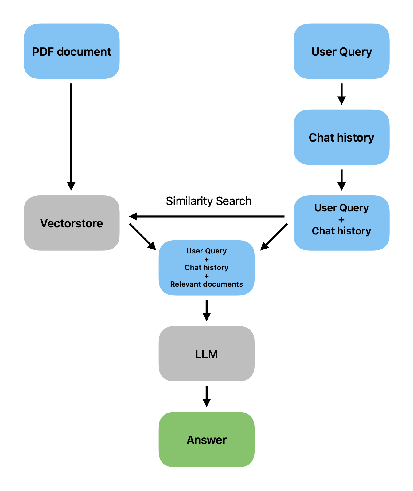
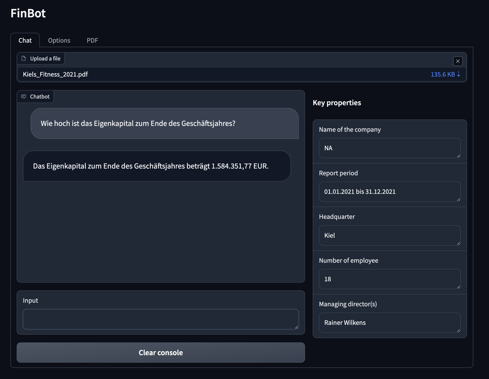
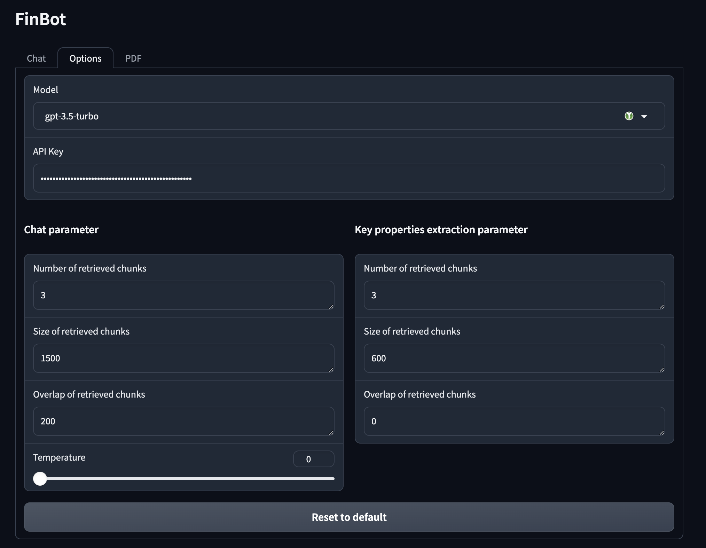
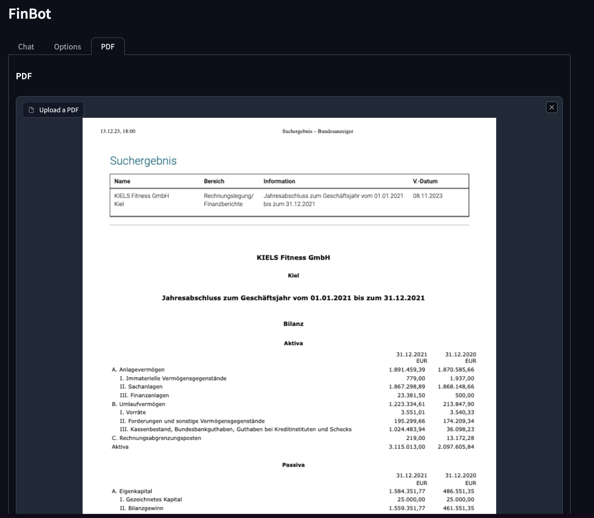
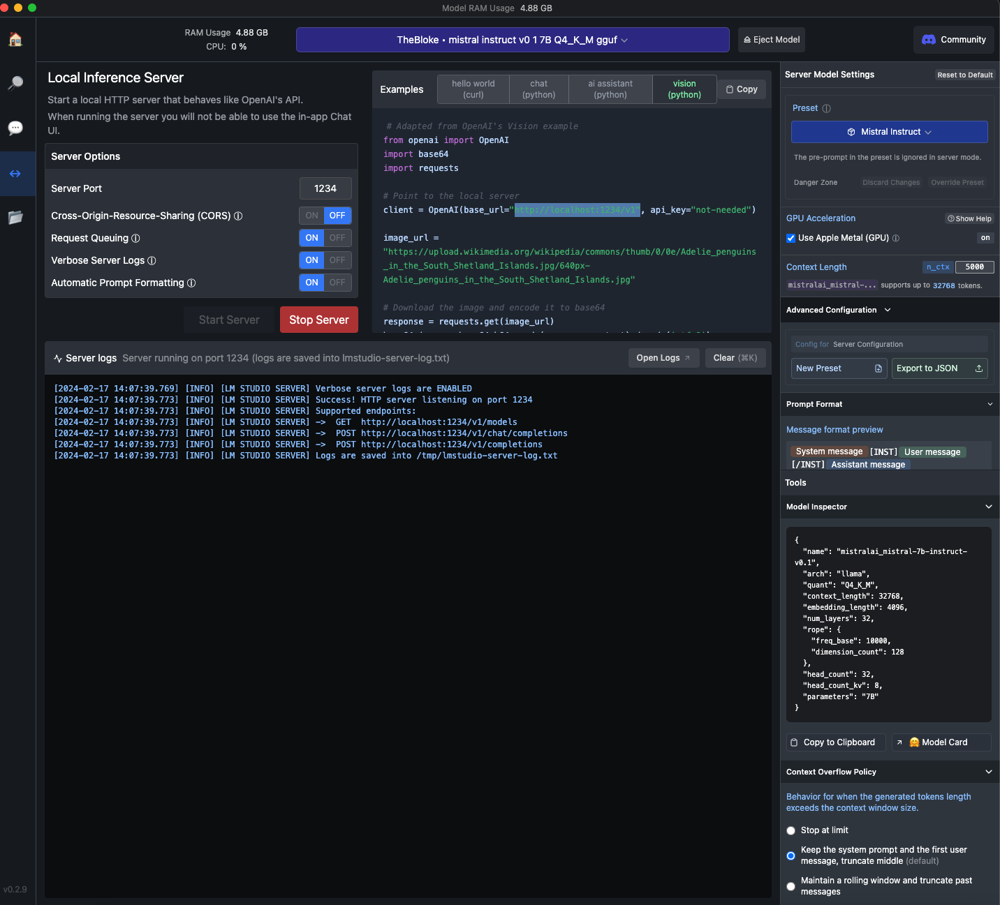

# Finbot - A chatbot for financial reports
A chatbot optimized to analyse and summarize financial reports including tables.

## What is FinBot

FinBot allows you to chat with an uploaded financial report, like annual and quarterly reports and is able to interpret not only unstructured text but also tables. It  offers an intuitive and easy to use interface and is able to extract pre- and userdefined parameters (e.g. name of the company, year of the report, number of employes, ..). FinBot is optimized to understand and summarize finincal reports and is able to generate precise responses.


## How does FinBot work?

- FinBot breaks documents into smaller chunks, creates embeddings and stores them in a vector database.
- FinBot performs a semantic search on your pdf content and to return the most relevant embeddings for your query, and passes them to the Large Language Model running in the background.

### Flowchart and Prototype


## How to run the latest FinBot version localy

Clone the repository
```
git clone https://github.com/pckw/FinBot.git
````

Set up a local environment, activate it and install the packages listed in requirements.txt. For exmaple using python venv
```python
python -m venv venv
source venv/bin/activate
pip install -r requirements.txt
```
Create config/config.yaml and add your API keys. This is optional. You may also provide your keys via the user interface later on.
```
OPENAI_API_KEY=sk-
COHERE_API_KEY=
```
To run FinBot execute
```python
python run_finbot.py
```
and open the provided local link in your browser.

## How to use FinBot

To get started just upload a report you want to chat with. The repository includes a few exmaple reports that you can find under `docs`. For example the 2021 report of KIELS Fitness. Once you select a report, the key properties are extracted. Use the chat interface to query your report.


The tab `Options` allows you to change the model, provide your API key if needed or adjust model parameter. If you provided your API keys via config/config.yaml, the API key should be filled automatically. Otherwise provide your key manually. The model parameter can be reset to a default set, by clicking on `Reset to default`. Change the file `config/model_parameter_default.json` to change the default parameters.
FinBot supports the following models
- GPT 3.5-turbo
- GPT 4
- Cohere
- Any local model hosted with LM Studio (see below)



The tab `PDF` displays your uploaded pdf.



## How to use FinBot with a local model hosted via LM Studio

You can connect FinBot to a local model hosted with [LM Studio](https://lmstudio.ai/). Select a downloaded model of your choice and start your local server in LM Studio. Make sure the url of your server is `http://localhost:1234/v1`. Once your server is running you can use the model with FinBot by selecting `LM Studio` as your model in the `Options` tab. No API key required.


