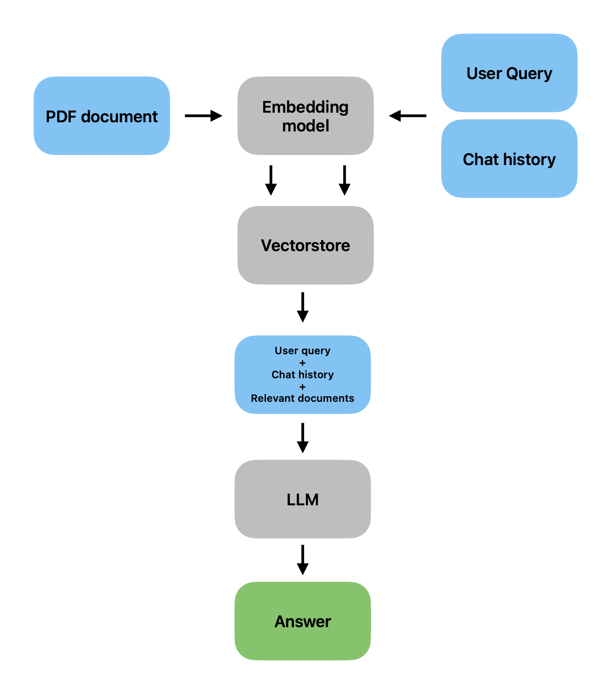

# Finbot - A chatbot for financial data
A chatbot optimized to analyse and summarize financial reports including charts and tables.

## What is FinBot

FinBot allows you to chat with an uploaded financial report, like annual and quarterly reports and is able to interpret charts and tables. It  offers an intuitive and easy to use interface and is able to extract pre- and userdefined Paramters (e.g. name of the company, year of the report, number of employes, profit/loss, ..). FinBot is optimized to understand and summarize finincal reports and is able to generate precise responses, including the page number where the information is located, adding credibility to the responses and helping to locate pertinent information quickly. The Responses are much better than the naive responses for exmaple by Open AI.


## How does FinBot work?

- FinBot breaks documents into smaller chunks, creates embeddings and stores them in a vector database.
- FinBot performs a semantic search on your pdf content and to return the most relevant embeddings for your query, and passes them to the Large Language Model running in the background.

### Flowchart and Prototype



## How do run the latest FinBot version localy

Clone the repository
```
git clone https://github.com/pckw/FinBot.git
````

Set up a local environment, activate it and install the packages listed in requirements.txt. For exmaple using python venv
```python
python -m venv venv
source venv/bin/activate
pip install -r requirements.txt
```
Create .env in the main directory and add your OpenAI API key
```
OPENAI_API_KEY=sk-
```

Startup Finbot
```python
python finbot_assistant.py
```